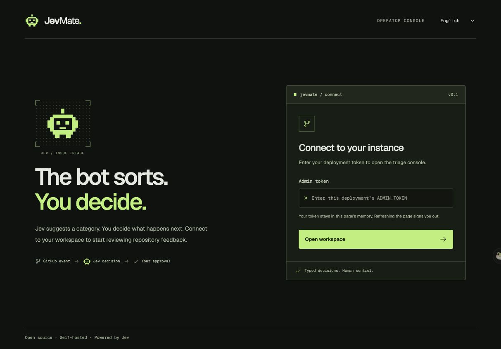
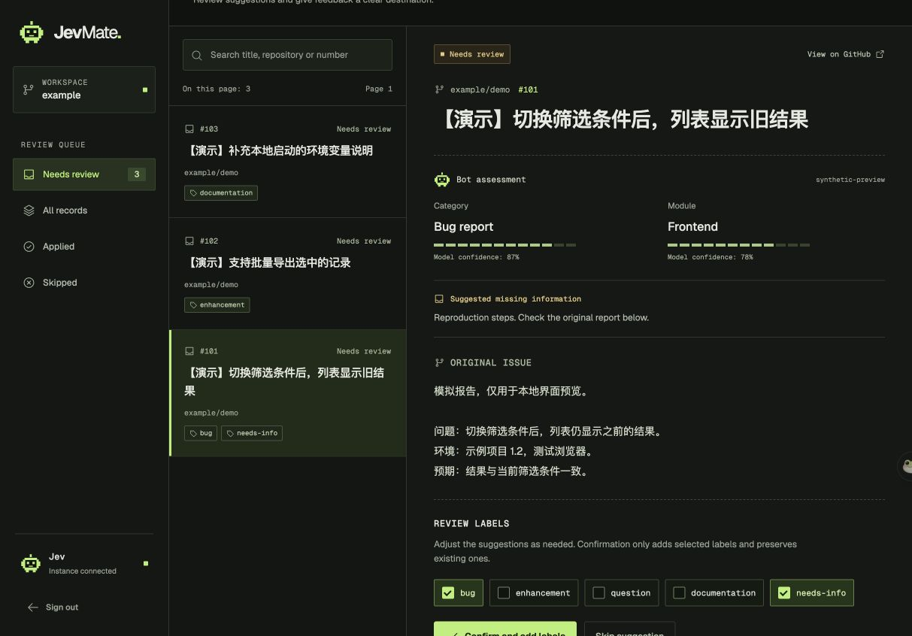

<p align="center">
  
</p>

<h1 align="center">JevRepoTriage</h1>

<p align="center">基于 <strong>Jev</strong> 的开源 GitHub Issue 分诊助手，可部署到自己的 Cloudflare 账户。</p>

<p align="center">
  <a href="https://github.com/murongg/JevRepoTriage/actions/workflows/ci.yml"></a>
  <a href="LICENSE"></a>
  <a href="https://github.com/murongg/JevRepoTriage/stargazers"></a>
  <a href="https://developers.cloudflare.com/workers/"></a>
  <a href="https://typesafe.ai/"></a>
</p>

Jev 负责判断类型、模块和信息完整度；维护者查看原文、修改建议并确认后，JevRepoTriage 才会给 Issue 添加标签。

## 界面

深色 Bot 控制台，包含像素机器人标识、紧凑的审阅分区和按需展开的导入面板。截图使用明确标注的本地模拟数据。




## 首版功能

- 接收新建、编辑和重新打开 Issue 的 GitHub Webhook，并验证签名。
- 使用 Queues 异步分析，支持失败重试与手动重新入队。
- 按仓库区分的 React 工作台：查看建议、核对原文、调整标签、确认应用、跳过、查看历史。
- 按页导入历史 Issue；每个 GitHub 页面最多 25 条，排除其中的 PR。
- GitHub 登录、独立个人工作区、每个用户自带 Jev Key，密钥加密保存。
- 支持多个 App 安装和仓库，也保留管理员令牌模式。
- 保留已有标签；应用前核对正文是否变化；失败重试保持原先确认的标签集合。

首版采用人工确认模式，不自动评论、关闭 Issue 或修改代码。不含重复检测、PR 审查、团队工作区与统一计费系统。Jev 是外部服务，需要自行申请 API 访问权限。本项目不是 TypeSafe 或 GitHub 官方产品。

## 多用户使用

按[公开登录配置](docs/deployment.md#public-github-login)启用 GitHub 登录后，任何 GitHub 用户都可以登录，填写自己的 Jev Key，安装 App 并连接仓库。每个个人工作区最多连接 100 个仓库，默认每天（UTC）最多执行 200 次模型分析。

登录后先进入可搜索的仓库列表，已连接仓库排在前面。选择已连接仓库可进入其 Issue 工作台，也可从列表直接连接可用仓库并进入。「全部仓库」可返回列表。选仓库之前不会显示 Issue 收件箱；列表、任务、历史与导入目标都只属于当前仓库。

仓库权限取用户权限与 App 安装权限的交集，应用标签使用该用户的 GitHub 授权。多人连接同一仓库时，分析记录和 Jev 费用各自独立；确认应用后会修改同一个 GitHub Issue。Cloudflare 费用由部署者承担。

旧管理员模式的数据不会自动分配给第一个登录用户。旧表会保留，个人工作区可重新导入 Issue。

## 本地运行

需要 Node.js 22.12+ 和 npm。

```sh
npm ci
cp .dev.vars.example .dev.vars
npm run db:local
npm run dev
```

在 `.dev.vars` 设置至少 32 字符的随机 `ADMIN_TOKEN`，打开 `http://localhost:8787`。令牌仅保存在当前页面内存中，刷新页面后需要重新输入。

真实分析需要设置 GitHub App 私钥、App ID、安装 ID、仓库白名单以及 Jev API Key。仅预览界面可按[本地预览说明](docs/preview.md)加载明确标注的模拟数据。

## 多语言

界面默认英文，不随浏览器语言自动切换。登录页和工作台顶部可切换 English / 简体中文，并在本机记住选择；浏览器禁用存储时仍可在当前页面切换。

切换语言会保留登录状态和已选标签。页面标题、提示、数字与已知错误跟随语言；Issue 原文、仓库名和 GitHub 标签名称保持原样。扩展语言见[多语言开发说明](docs/localization.md)。

## 自托管部署

按照[部署文档](docs/deployment.md)创建 D1、任务队列、GitHub App，配置 Worker Secrets，然后部署。

整个前后端由一个 Worker 提供，React 静态文件由 Workers Static Assets 托管。无需维护常驻服务器。Cloudflare 和 Jev 分别计费，项目不承诺始终免费。

## 自定义规则

编辑 `policy.json` 后重新部署。可配置类别、模块含义和对应标签。默认模块只显示判断结果，不添加模块标签。

要添加的标签必须预先存在于 GitHub 仓库。默认使用 `bug`、`enhancement`、`question`、`documentation`、`needs-info`。所有仓库共用这一份策略。保留类别键 `bug` 和模块键 `unknown`。

## 验证

```sh
npm run check
```

包含类型检查、模拟外部 API 的自动测试、本地 D1 集成测试与部署包构建。测试数据均为虚构。上线前仍需使用自己的凭据完成真实 GitHub → Jev → 标签应用流程验证。

## 数据范围

Issue 标题与正文会发送给 TypeSafe，并保存在你自己的 D1 中。私有仓库也遵循这个数据流。移除白名单或卸载 App 不会自动删除已经保存的记录。首版没有自动数据清理计划。

## 开源协议

MIT，详见 [LICENSE](LICENSE)。欢迎通过 Issue 与 PR 改进；参与方式见 [CONTRIBUTING.md](CONTRIBUTING.md)。
